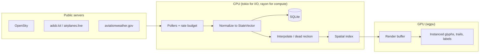

# Look Above

[](https://github.com/arcTanMyAngle/look-above/actions/workflows/ci.yml)

A flight tracker that runs on your own machine. Rust, native window, no browser.
It asks public servers what is currently in the sky and draws it.

---

## The premise

Right now there are roughly ten thousand aircraft airborne. Most are shouting.

An aircraft with ADS-B broadcasts its own position twice a second, unencrypted, to
anyone within about 250 miles — callsign, altitude, heading, speed. It is not a
signal anyone is trying to keep. Volunteers point cheap antennas at the sky, catch
it, and pool what they hear into public servers.

This program talks to those servers and paints what they know.

That is the whole trick, and it's worth being clear about the unglamorous part:
**there is no antenna here.** No dongle, no receiver, no roof. Look Above makes
HTTPS requests and parses JSON. Everything it knows, it was told.

---

## What you're actually looking at

The vocabulary is small. Learn these five and the rest of the codebase reads
plainly.

**ICAO24** — every airframe carries a 24-bit address burned in at the factory.
Six hex digits: `a1b2c3`. It is the aircraft, not the flight. A 737 keeps its
ICAO24 for its whole life. In this code it's [`Icao24`](crates/core/src/types.rs),
and it's stored as three raw bytes rather than text, because feeds disagree about
whether to shout it (`A1B2C3`) or whisper it (`a1b2c3`) and they mean the same
plane.

**Callsign** — what the flight is called today. `DAL123`. It belongs to the trip,
not the airframe; the same aircraft flies under a new one tomorrow. Often blank.

**ADS-B** — the aircraft broadcasting its own GPS position. This is the good stuff:
the plane speaking for itself.

**TIS-B and ADS-R** — the confusing stuff, and worth a paragraph, because it's why
there's a strange-looking guard in the parser.

> Ground stations sometimes invent traffic. If an aircraft has *no* ADS-B, radar
> can still see it, and a ground station will broadcast that radar contact on the
> aircraft's behalf so that nearby planes have a complete picture. That's **TIS-B**.
> Similarly, ADS-B runs on two different frequencies, and ground stations relay
> between them so both halves of the sky can see each other. That's **ADS-R**.
>
> Both produce records that look like aircraft but aren't reports from an aircraft.
> They carry a made-up address rather than a real ICAO24, and the community feeds
> mark them by sticking a `~` on the front: `~ab1234`.
>
> You do not own any of this. It's ground infrastructure, mostly American, run by
> the FAA. It matters to us for exactly one reason: **those records show up in the
> JSON anyway**, and if we parsed `~ab1234` as an aircraft address we'd invent a
> plane that does not exist and track it across the map. So `Icao24::from_hex`
> refuses anything that isn't six clean hex digits, and every feed adapter has to
> decide what to do about the rest, out loud, in code.

**Dead reckoning** — the servers update every 5–15 seconds. Screens run at 60 fps.
Between fixes we advance each aircraft along its own heading at its own speed and
draw where it *should* be. Without this, planes teleport. With it, they fly. The
math is [`destination_point`](crates/core/src/geo.rs).

---

## The rules, which are not negotiable

Some aircraft are deliberately anonymous. The FAA runs programs — LADD and PIA —
that let an owner opt out of public identification, and the feeds honor them: you
get a position with no identity attached, or a rotating fake address.

We never undo that. No cross-referencing an anonymous target against a registry,
a history table, or a third-party API to work out who it is. The `anonymous` flag
on a position is a gate, and it's sticky: once a target is anonymous for a session,
a later record claiming an identity does not reopen it.

The aim is watching the sky, not watching a person. There is no tail-number search,
no alert-on-this-hex, no export. [docs/04](docs/04_PRIVACY_AND_SAFETY_RULES.md) is
the binding version, and a change that breaks those rules gets rejected no matter
how good the feature is.

Data comes only from an explicit allowlist: OpenSky Network (free account),
airplanes.live and adsb.lol (no key), aviationweather.gov, OurAirports. We use
documented APIs inside their published rate limits. We do not scrape FlightRadar24,
FlightAware, or ADS-B Exchange.

---

## The machine

The design has one real opinion: **the CPU does the thinking, the GPU only draws.**

Every position that arrives has to be interpolated, projected, indexed, and culled.
That's the interesting parallel work, and it runs across your cores with `rayon`.
By the time the GPU is involved, the answer is already computed — it rasterizes a
prepared buffer of glyphs and gets out of the way.



Network I/O is `tokio` and lives only in `ingest`. Compute is `rayon`. The two
talk through `crossbeam` channels. The render loop never blocks on either — a slow
API call must never cost a frame.

Six crates, and the dependencies only point one direction:

| Crate | Job | Knows about |
|---|---|---|
| [`core`](crates/core/) | Types, geo math, contracts, sim, camera/LOD | Nothing. No network, no DB, no GPU. |
| [`ingest`](crates/ingest/) | Feed adapters, polling, budgets, METAR, adsbdb | `core` |
| [`store`](crates/store/) | SQLite, migrations, writer thread, enrichment tables | `core` |
| [`render`](crates/render/) | wgpu pipelines, shaders, camera, LOD tiers, labels | `core` |
| [`import`](crates/import/) | One-shot fetch/convert of bundled OurAirports + basemap data | `core` |
| [`app`](crates/app/) | The binary: wiring, config, window | all of them |

`core` staying ignorant is the load-bearing constraint. It's why the whole
vocabulary and both trait seams can be unit-tested without a socket or a GPU.

---

## Where it stands

Honest answer: it draws the live sky. A native window renders real aircraft, in two
view modes, with pixels changing under your cursor as you pan and zoom.

- **Done — M0 (foundation):** the cargo workspace, pinned dependencies, the `core`
  vocabulary (`StateVector`, `Icao24`, `CallSign`, `BBox`), the `LiveSource` / `Store`
  trait seams, the geo math (haversine, initial bearing, destination point, Web
  Mercator forward and inverse), config loading, a native window, and CI.
- **Done — M1 (live ingestion):** a shared HTTP client that enforces the host allowlist,
  OpenSky OAuth2, and live position sources normalized into one `StateVector` stream —
  OpenSky `/states/all` (credit-metered) plus the keyless readsb feeds airplanes.live and
  adsb.lol. A daily credit budget with a cadence controller, a failover poller,
  cross-source dedup with sticky anonymity, SQLite persistence, and the fixture recorder
  below.
- **Done — M2 (renderer):** the wgpu surface, tessellated Natural Earth base map,
  instanced heading-aware aircraft glyphs, rayon-parallel dead-reckoning/interpolation
  feeding a double-buffered render path, and a pan/zoom regional (Web Mercator) camera.
- **Done — M3 (enrichment):** OurAirports import (airports/runways into SQLite), METAR
  polling with flight-category badges, adsbdb selection lookups behind the anonymity
  gate, and the selection info card.
- **In progress — M4 (dual-mode LOD & interaction):** the orthographic globe (L0) with
  density rendering, L0↔L1↔L2 tier switching, the globe↔regional camera transition,
  label collision culling, and the final altitude color ramp are in place and
  live-verified. Two acceptance lines remain open: a tier-boundary cross-fade that still
  reads as a pop rather than a fade, and a fresh 8,000+-aircraft global performance
  reading (the last attempt was invalidated by an OpenSky failover mid-run). See
  [plans/M4_DUAL_MODE_LOD_AND_INTERACTION.md](plans/M4_DUAL_MODE_LOD_AND_INTERACTION.md).
- **Not yet** — position-history replay and the time scrubber (M5); settings UI, themes,
  and packaging (M6).

The truthful status always lives in [plans/CURRENT_STATUS.md](plans/CURRENT_STATUS.md),
and every non-obvious decision, with its reasoning, is in
[plans/DECISION_LOG.md](plans/DECISION_LOG.md). If this README and those disagree,
believe those.

---

## Running it

### Quick start (no coding knowledge needed)

Three steps, and step 1 only happens once.

**1. Install Rust.** This gives your computer the tools it needs to build the app.
Go to [rustup.rs](https://rustup.rs), download the installer for your operating
system, and run it, accepting the defaults. (Windows note: the installer may ask you
to also install "Visual Studio Build Tools" — say yes to that if prompted.)

**2. Get the code.** Open a terminal (Windows: PowerShell; Mac/Linux: Terminal) and
run:

```sh
git clone https://github.com/arcTanMyAngle/look-above.git
cd look-above
```

**3. Run it:**

```sh
cargo run -p look-above
```

The first run downloads and builds everything, which can take several minutes and
looks like nothing is happening — that's normal, let it finish. After that, a window
opens and starts drawing real aircraft currently in the sky. No account, no API key,
and no extra setup is required — it works immediately using free, keyless data feeds.
Running it again later is fast, since the build is only redone when the code changes.

To close the app, just close its window.

*Optional:* a free [OpenSky Network](https://opensky-network.org) account gives the
app a higher-coverage data source. Not required to use the app — see
`config.example.toml` for how to add the credentials if you want them.

### For developers

```sh
cargo test --workspace     # all offline; the default
cargo run -p look-above    # opens the window

# Record a fixture from the live API — the only sanctioned live fetch besides running
# the app. Keyless for the community feeds; writes the trimmed, credential-scrubbed
# reply to crates/ingest/tests/fixtures/<source>/<name>.json and prints only a count,
# never the payload. The LAST argument is the output file name: use a scratch name to
# inspect a source's shape. Passing an existing fixture name (e.g. point_nominal)
# OVERWRITES that committed fixture with live data and will break its exact-value tests
# — only do that deliberately, per the fixture READMEs; `git checkout` restores it.
cargo run -p look-above-ingest --bin record-fixture -- adsblol 47 8 73 sample
```

`cargo run -p look-above` opens a native window, so it needs a graphical desktop
session. On Windows, run it from PowerShell. Under WSL it needs WSLg (or an X server
with `DISPLAY` set) — without one it exits with *"Could not find wayland compositor"*,
which is the environment having nowhere to draw, not a fault in the app. The tests and
the fixture recorder are headless and run anywhere.

Rust stable 1.96, pinned in `rust-toolchain.toml`. SQLite is compiled in; there's
nothing to install. OpenSky is the one source that needs an account: its client id and
secret come from the `LOOK_ABOVE_OPENSKY_*` environment variables, a gitignored
`config.toml`, or the gitignored `credentials.json` OpenSky issues — never committed.
The community feeds need no key.

---

## The map

| Path | What's in it |
|---|---|
| [docs/](docs/) | The spec, numbered 00–13: vision, rendering, data sources, privacy, schema, tests, acceptance |
| [plans/](plans/) | Milestone plans, current status, decision log, risks |
| [crates/](crates/) | The code |
| [CLAUDE.md](CLAUDE.md) / [AGENTS.md](AGENTS.md) | House rules for AI sessions in this repo |

Work goes one milestone item at a time, and each one ends with tests green,
the decision log written, and a commit. Milestone gates stop for human review.
M0 workspace → M1 ingestion → M2 renderer → M3 enrichment → M4 LOD and interaction
→ M5 history → M6 polish. Detail in [docs/07](docs/07_MILESTONE_PLAN.md).

---

## Attribution

Live data from [The OpenSky Network](https://opensky-network.org) and the
volunteer-run aggregators at [airplanes.live](https://airplanes.live) and
[adsb.lol](https://adsb.lol) — people who bought antennas and gave the results
away. Weather from the NOAA Aviation Weather Center. Airports from
[OurAirports](https://ourairports.com), public domain.

The sky is public. This just points at it.
