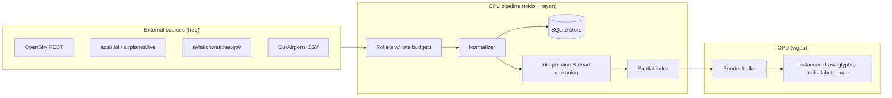

# Look Above ✈️

A native, high-fidelity flight tracker written in **Rust**. Live aircraft are ingested from
free, authorized aviation data sources, processed by a CPU-parallel data pipeline, and drawn
by a thin GPU layer — zoomable from a whole-world overview down to a detailed regional view.

> **Status:** Documentation scaffold complete. Implementation has not started.
> See [plans/CURRENT_STATUS.md](plans/CURRENT_STATUS.md) for where things stand.

## What it is

- **Native Rust app** — no browser, no Electron. `winit` window + `wgpu` renderer.
- **CPU for data, GPU for pixels** — ingestion, interpolation, geo-math, and spatial indexing
  run on CPU worker threads (`rayon`); the GPU only rasterizes instanced glyphs, trails, and map geometry.
- **Dual view modes** — a global overview (density visualization) and a regional mode
  (oriented aircraft glyphs, altitude-colored trails, labels), with smooth level-of-detail
  transitions between them.
- **Free & authorized data only** — OpenSky Network (free account) as the primary live feed,
  with no-signup community fallbacks, NOAA weather, and open airport datasets. No scraping,
  no paid APIs. See [docs/03_DATA_SOURCES_NON_ADSB.md](docs/03_DATA_SOURCES_NON_ADSB.md).
- **Privacy-respecting** — blocked tail numbers (LADD/PIA) are never tracked, inferred, or
  displayed. See [docs/04_PRIVACY_AND_SAFETY_RULES.md](docs/04_PRIVACY_AND_SAFETY_RULES.md).

## Architecture at a glance



## Repository map

| Path | Purpose |
|---|---|
| [CLAUDE.md](CLAUDE.md) / [AGENTS.md](AGENTS.md) | Rules for AI coding sessions in this repo |
| [prompts/](prompts/) | Master prompt that kicks off implementation sessions |
| [docs/](docs/) | Product vision, rendering spec, data sources, schema, tests, acceptance criteria (numbered 00–13) |
| [plans/](plans/) | Milestone plans (M0–M2 detailed), current status, decision log, risk register, next actions |
| [.claude/agents/](.claude/agents/) | Specialized subagents (architecture, data-source, renderer, geo-math, storage, testing, ux) |
| [.claude/skills/](.claude/skills/) | Skills: authorized aviation sources, flight visualization, token-managed implementation |

## Roadmap

M0 workspace & architecture → M1 authorized data ingestion → M2 high-fidelity renderer →
M3 enrichment data → M4 dual-mode LOD & interaction → M5 persistence/history/replay →
M6 polish & packaging. Details: [docs/07_MILESTONE_PLAN.md](docs/07_MILESTONE_PLAN.md).

## Quick start (once M2 lands)

```sh
cargo run --release -p look-above
```

Requires Rust stable (1.85+). OpenSky credentials go in `config.toml` (never committed);
the app falls back to no-key community sources without them.

## Attribution

Live tracking data courtesy of [The OpenSky Network](https://opensky-network.org) and
community ADS-B aggregators. Weather from NOAA Aviation Weather Center. Airport data from
[OurAirports](https://ourairports.com) (public domain).
